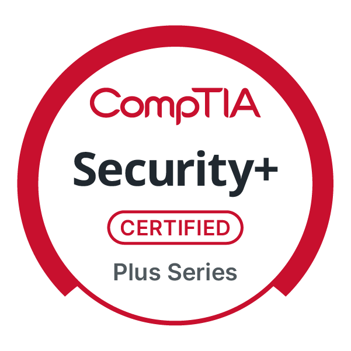

# Hello, I'm Eli

I am a cybersecurity professional with 9+ years in home system admin and home network building experience. In my free time I partake in CTF's on vulnerable machines and try my hand at bug bounty hunting.

## Skills & Technologies

### Certifications & Certificates
- CompTIA Security+ ce (Expires July 2029)
- Cisco Networking Academy: Network Defense (Completed May 2026)
- Cisco Networking Academy: Networking Basics (Completed April 2026)
- Coursera: Google AI Essentials (Completed April 2026)

### Security Skills
- **Penetration Testing:** Network scanning, vulnerability assessment, exploitation
- **Network Security:** Firewall config, IDS/IPS, packet analysis

### Technical Skills
- **Operating Systems:** Kali Linux, Windows 10/11, Proxmox
- **Tools:** Nmap, Metasploit, Wireshark, Burp Suite

## Career Goal

My journey with computers has gotten me to this point and I hope that it continues to do so. One day I hope to open my own security consultancy firm, performing digital and physical penetration testing. I am eager to start my professional technology journey, specifically aiming to join an SOC or Digital Forensics team.

## Current Focus

- Hands on labs in Splunk and Wazuh SIEM's
- Learning about security frameworks (ISO 27001, SOC2, NIST 800-53)
- CTF writeups
- Amateur bug bounty hunting

## Featured Projects

### 1. Home Lab 
**Description:** A combination of virtual machines, physical devices, and various forms of networking. I use it to perform CTF challenges on vulnerable machines, work on lateral movement, and perform malware analysis.\
**Technologies:** Proxmox, Kali Linux, Windows 10/11, Network Switch, Dell OptiPlex 7040M\
**Key Features:**
- Type-1 and Type-2 Hypervisors
- Multiple OSs for various lab interfaces and environments
- Network segmentation (i.e. Sandboxing, Airgapping, Internal Network)
- Wazuh SIEM for malware analysis, detection, and response practice

## Education

**Certificate of Completion**\
Per Scholas | Expected Completion: July 2026\
Relevant Coursework: Network Defense, Cryptography, Linux Basics, Splunk labs

## Links

